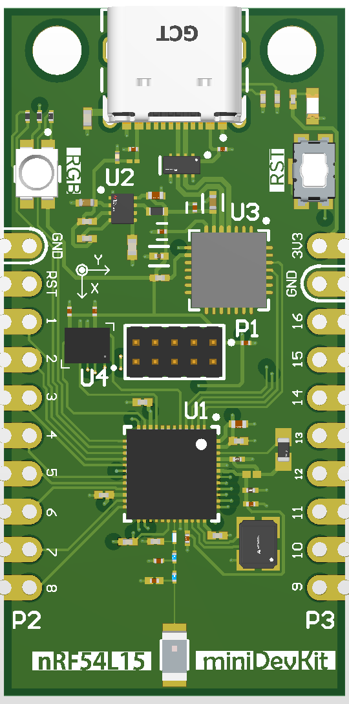
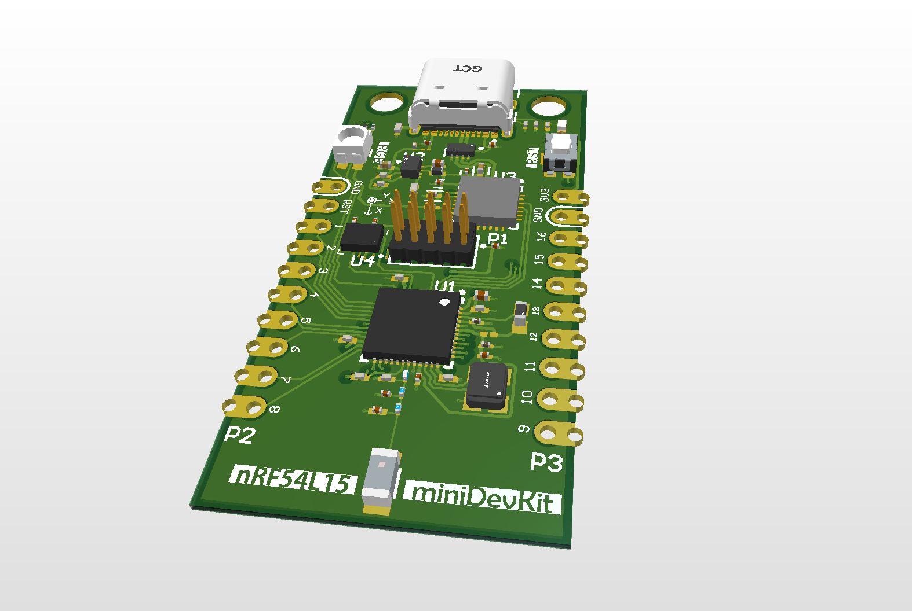

# nRF54L15 miniDevKit

## Description   
The **nRF54L15 miniDevKit** is a high-performance, custom-designed development board featuring the **Nordic Semiconductor nRF54L15** SoC. Designed in **Altium Designer**, this board is tailored for embedded development, IoT applications, and prototyping. It highlights advanced **PCB design principles**, power management, and optimized signal routing.  

## Features  
- **nRF54L15 SoC** – Ultra-low-power ARM Cortex-based wireless microcontroller  
- **16 GPIO Pins** – Two can be used for an NFC antenna  
- **Onboard BMI323 IMU** – Connected via SPI with two interrupt lines  
- **Onboard RGB LED** – Connected to GPIOs 2.01, 2.02, and 2.03  
- **Onboard 10-pin(2x5) 1.27" SWD Header** – For debugging and flashing  
- **Onboard USB to UART Bridge** – Enables programming and serial communication with a PC  
- **Onboard High-Performance Chip Antenna** – Optimized for Bluetooth connectivity  
- **USB-C Interface** – Used for power and firmware flashing  
- **Optimized Power Management** – Supports multiple power input options  
- **Castellated GPIO Pads** – Can be used with PTH headers or mounted as an SMD component  
- **4-Layer PCB Stackup** – Signal/Ground/Ground/Signal for enhanced signal integrity and noise reduction  

## GPIO Table  

| Zephyr DT ALIAS  / nRF Pin Number | Function     | Description                                     |  
|-----------------------------------|--------------|-------------------------------------------------|
| 1 / P2.04                         | GPIO/SPI-SDI | General-purpose I/O / SPI Data In / BMI323 SDO  |  
| 2 / P2.05                         | GPIO/SPI-CS  | General-purpose I/O / SPI Chip select              |  
| 3 / P2.06                         | GPIO/SPI-SCK | General-purpose I/O / SPI Clock / BMI323 CLK    |  
| 4 / P2.08                         | GPIO/SPI-SDO | General-purpose I/O / SPI Data Out / BMI323 SDI |  
| 5 / P2.09                         | GPIO         | General-purpose I/O                             |  
| 6 / P2.10                         | GPIO         | General-purpose I/O                             |  
| 7 / P0.00                         | GPIO         | General-purpose I/O                             |  
| 8 / P0.01                         | GPIO         | General-purpose I/O                             |  
| 9 / P0.09                         | GPIO         | General-purpose I/O                             |  
| 10 / P0.10                        | GPIO         | General-purpose I/O                             |  
| 11 / P1.11                        | Analog input | General-purpose I/O / Analog                    |  
| 12 / P1.12                        | Analog input | General-purpose I/O / Analog                    |  
| 13 / P1.13                        | Analog input | General-purpose I/O / Analog                    |  
| 14 / P1.14                        | Analog input | General-purpose I/O / Analog                    |  
| 15 / P1.02                        | NFC input    | General-purpose I/O / NFC antenna connection    |  
| 16 / P1.03                        | NFC input    | General-purpose I/O / NFC antenna connection    |  
| -  / P1.04                        | IMU - INT1   | BMI323 interrupt 1                              |
| -  / P1.08                        | IMU - CS     | BMI323 Chip select                              |
| -  / P2.00                        | IMU - IN2    | BMI323 interrupt 2                              |
| -  / P2.01                        | RGB - Green  | RGB LED Green                                   |
| -  / P2.02                        | RGB - Red    | RGB LED Red                                     |
| -  / P2.03                        | RGB - Blue   | RGB LED Blue                                    |

## Power  
The **nRF54L15 miniDevKit** supports multiple power input options:  
- **USB-C (5V Input)** – Primary power source, regulated to 3.3V  
- **3V3 pin** – Connect with a stable 3.3V DC power supply

## Mechanical & Design Files  
The following files are included in the project folder for reference:  
- **[Mechanical Drawings](Schematics/nRF54L15_miniDevKit%20-%20Mechanical.pdf)** – Provides dimensions and mounting details  
- **[3D Model](3D%20model/)** – A full 3D representation of the board for enclosure design  
- **[Schematics (PDF)](Schematics/nRF54L15_miniDevKit.pdf)** – A complete circuit diagram of the board 

## Design Considerations  
- **Hierarchical Schematic Design** – Implemented in Altium for improved readability and modularity  
- **RF and High-Speed Signal Integrity** – Antenna and USB differential pairs routed with controlled 50Ω impedance  
- **EMC Compliance** – Optimized component placement and decoupling capacitor positioning to minimize noise  
- **Castellated Edges** – Enables direct PCB mounting or use with through-hole headers  
- **4-Layer PCB Stackup** – Signal/Ground/Ground/Signal for enhanced EMI shielding and performance  

**Note:** The nRF54L15 ships blank from the factory. Users must flash a custom [DFU over UART](https://academy.nordicsemi.com/courses/nrf-connect-sdk-intermediate/lessons/lesson-8-bootloaders-and-dfu-fota/topic/exercise-1-dfu-over-uart/) bootloader using the **SWD header** and a debugger like **JLink**. Once installed, the **USB-C** interface can be used for firmware flashing.  
